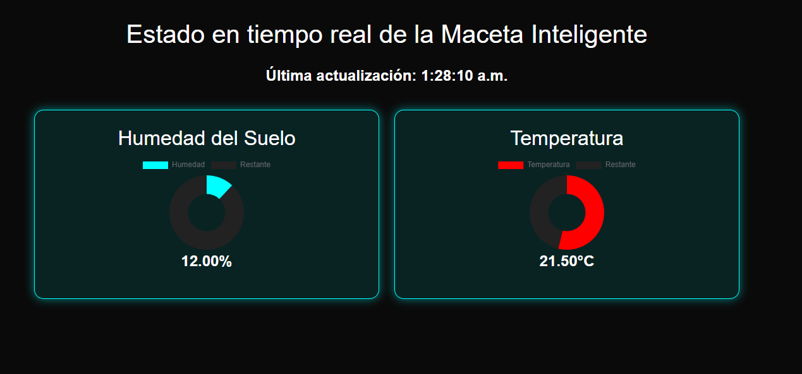

# Maseta Inteligente

## Descripción

La maseta inteligente sera un sistema automatizado diseñado para monitorear y mantener condiciones ideales para el crecimiento de cualquier planta pequeña. Estará equipada con un microcontrolador **ESP32** que le proporciona conectividad WiFi para enviar datos en tiempo real anuestra API. Se planea que el sistema incluya tres sensores que permitiran medir parámetros clave del ambiente de la planta:

- **Sensor de Temperatura DHT11**: Mide la temperatura ambiente.
- **Sensor de Humedad del Aire DHT11**: Monitorea la humedad relativa del aire.
- **Sensor de luz**: Mide la cantidad de luz que recibe la planta
- **Sensor de Humedad de Tierra**: Determina el nivel de humedad en el sustrato de la planta.

Gracias a la integracion de nuestra API, estos datos pueden ser visualizados y gestionados de forma remota, permitiendo alertas personalizadas y un seguimiento continuo del estado de la planta.

## Características de la maseta

## Requisitos

- **ESP32**.
- **Sensores**:
  - Sensor de temperatura.
  - Sensor de humedad del aire.
  - Sensor de humedad de tierra.
- Conexión a red WiFi.

