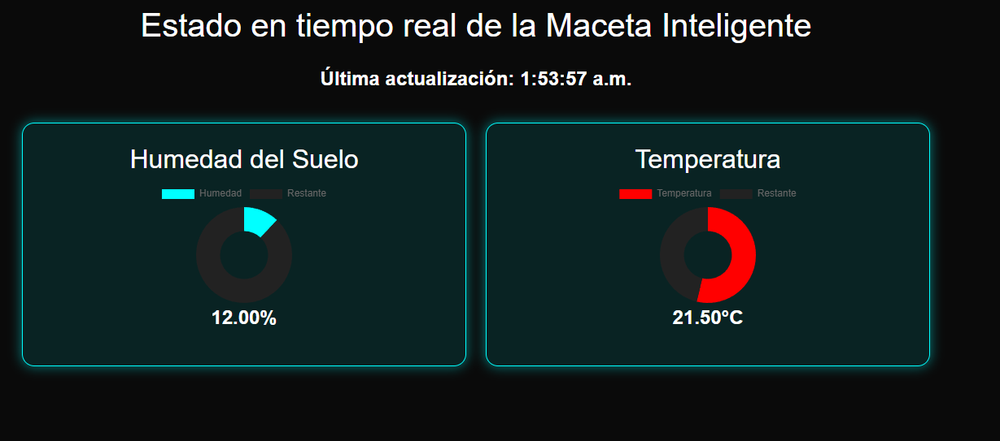

# Maceta Inteligente

## Descripción
La maceta inteligente es un sistema automatizado diseñado para monitorear y mantener condiciones ideales para el crecimiento de cualquier planta pequeña.

## Sensores de Monitoreo

- **Sensor de Temperatura DHT11**: Mide la temperatura ambiente.
- **Sensor de Humedad del Aire DHT11**: Monitorea la humedad relativa del aire.
- **Sensor de Luz**: Mide la cantidad de luz que recibe la planta.
- **Sensor de Humedad de Tierra LM393**: Detecta el nivel de humedad de la tierra.

## Características
- **Pantalla OLED para visualizar los datos.**
- **Panel web para visualizar los datos a distancia.**

## Conectividad
- **Microcontrolador inalámbrico HC-12:** Utilizado para la transmisión de datos a larga distancia.
- **ESP32 con conectividad WiFi:** Permite la conexión a internet para la visualización remota de datos.

## Funcionamiento
La maceta utiliza el microcontrolador inalámbrico HC-12 para enviar los datos al ESP32, que estará conectado a WiFi. Esto permite mantener la maceta en zonas donde el WiFi no esté disponible. Gracias a la integración de nuestra API, los datos pueden ser visualizados y gestionados de forma remota.

[Ver avance](https://maceta.codehost.xyz/view/index.html)

